# Web Dreamer

## 介紹

- 網頁協作平台
- 幫助大家快速輕鬆建立屬於自己的網頁
- 通過拖拉，可以新增文字 / 圖片區塊以及調整區塊順序
- 可以通過預覽鍵，預覽自己網頁

## 註冊及登入

### 註冊

1. 點選 SIGN UP 頁面
2. 輸入Email、密碼、及再次確認密碼
3. 點選 CONTINUE 鍵
4. 成功後，會跳入 LOGIN 頁面，並在下方顯示 SIGN UP SUCCESSFULLY

 ⚠️ **規範**

如發生以下錯誤訊息時，請更正自己的輸入：

1. Email 不得已註冊過        This Email Has Been Registered
2. 密碼長度需大於等於 8          Enter a Long Password
3. 確認密碼需等於前面密碼        Enter The Same Password To Confirm

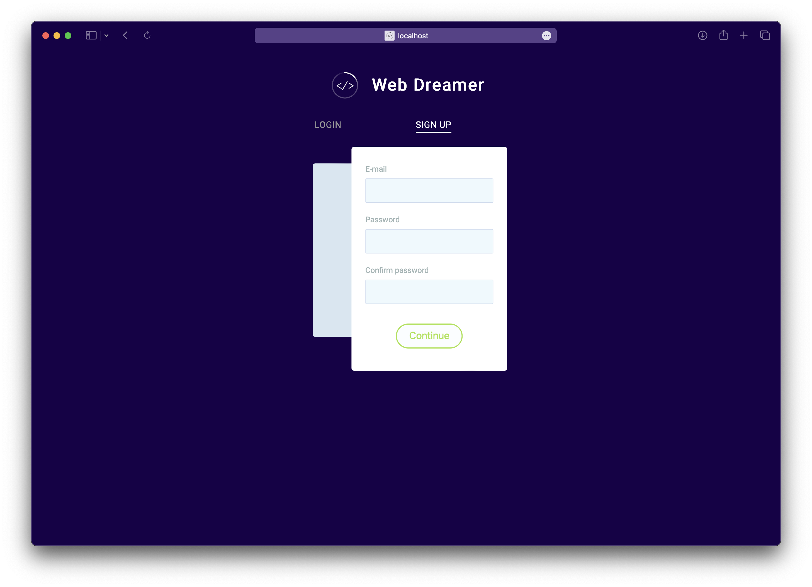

## 登入

1. 輸入正確 Email 及 Password
2. 點選 LOGIN 鍵
3. 成功後，會進入專案瀏覽頁面

 ⚠️ **規範**

如發生以下錯誤訊息時，請更正自己的輸入：

1. Email 沒輸入        Enter The Email
2. Password 沒輸入          Enter The Password
3. Email 及 Password 在資料庫中不一致        Enter Right Email or Password

 ℹ **功能**

1. 輸入過後，下次會自動填入此帳號

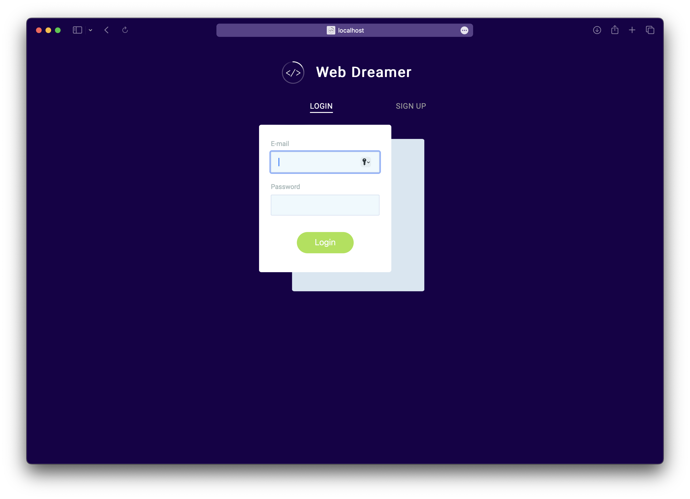

## 專案瀏覽

### 創建專案

點選 Create Project 鍵

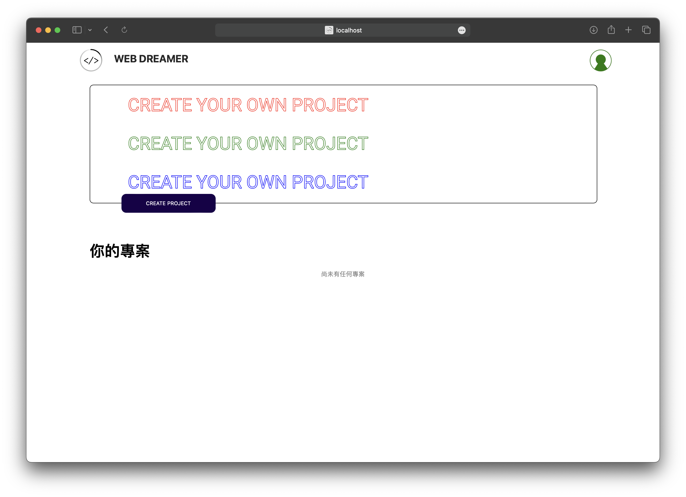

 ℹ **功能**

1. 專案名稱預設為 default 
2. 會顯示上次修改儲存時間
3. 點選 刪除鍵 可以把不要的專案刪除
    
    
    

### 專案編輯

1. 點選 你要編輯的專案名稱
2. 開始編輯

 📝 **專頁編輯功能**

- 由右側拉方塊至左側網頁中的變色方塊內，以增加方塊
    
    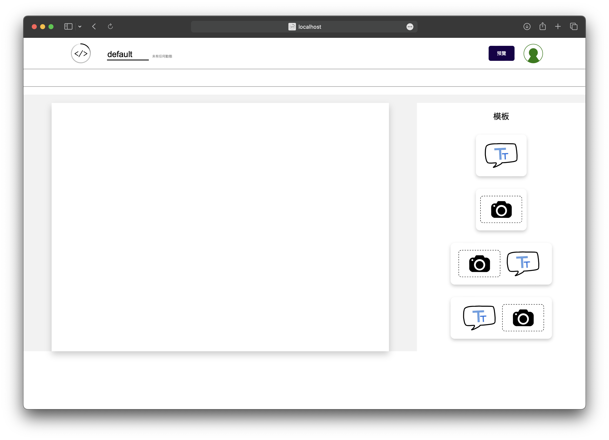
    
- 點選文字方塊，以編輯該文字
    
    *增減文字、粗體、斜體、刪減線、置左、置中、置右、字體顏色、背景顏色、刪除文字方塊*
    
    ⚠️ 含底線的功能均為先選取需要變化文字，再做出相對應改變
    
    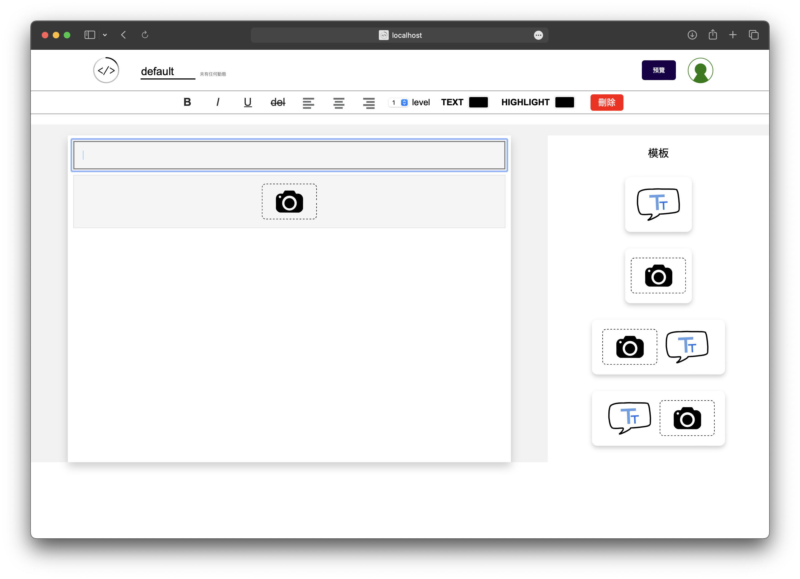
    
- 點選圖片方塊（相機圖案），以編輯該圖案
    
    *置左、置中、置右、調整長寬、上傳圖片、刪除圖案方塊*
    
    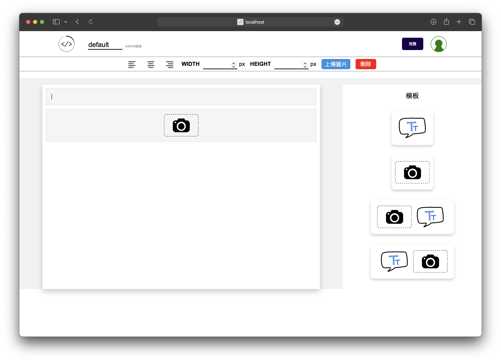
    
- 拖拉左側任一方塊至任一方塊上，產生紫色顏色，便可以將該方塊題至該位置
    
    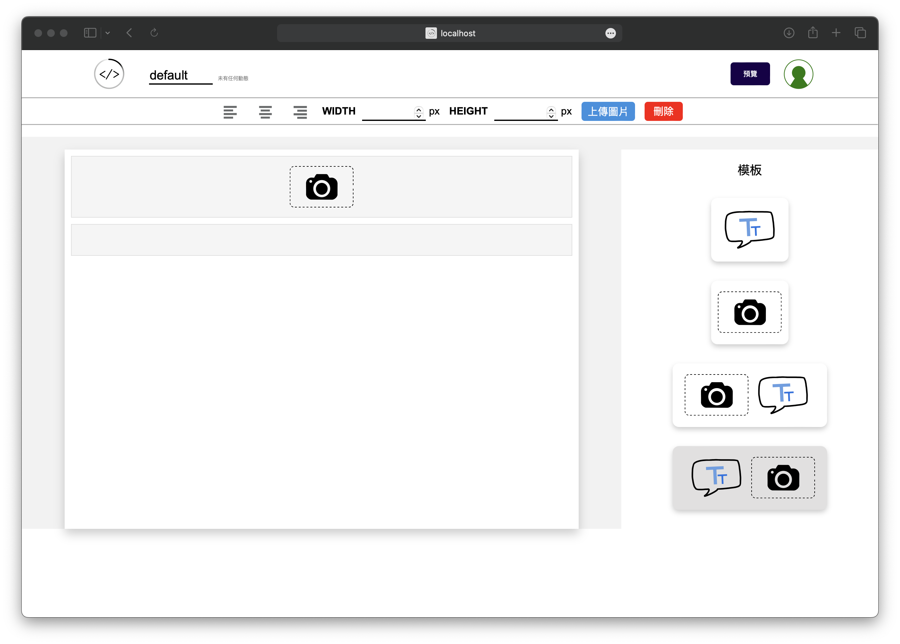
    

 ℹ **附加功能**

1. 每 5 秒鐘自動進行儲存
2. 專案名稱藉由點選 LOGO 旁邊字樣進行編輯，只要點選任何一方就會儲存新的專案名稱
3. 任何狀態會出現在專案名稱旁
1. 完成
    
    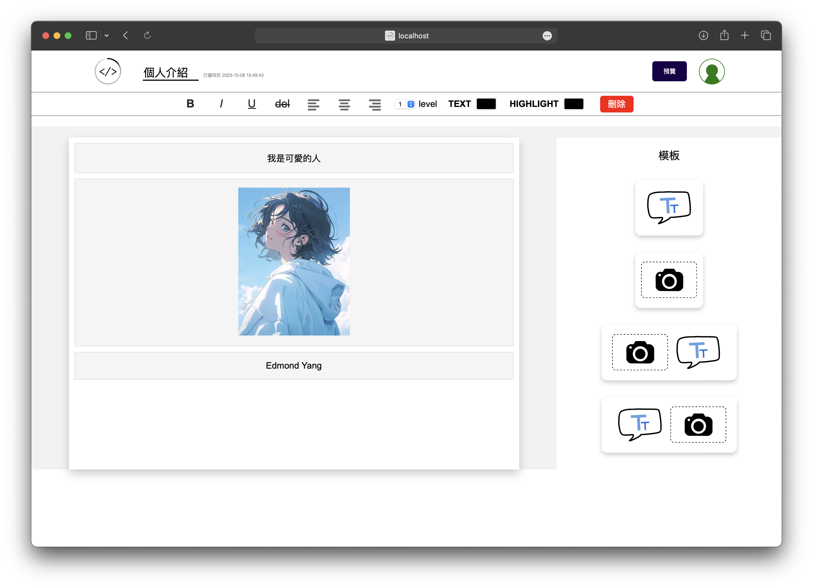
    

### 專與預覽

點選 預覽鍵 即可在旁邊分頁中進行預覽

 ⚠️ 注意

需先儲存完才能展示預覽效果喔

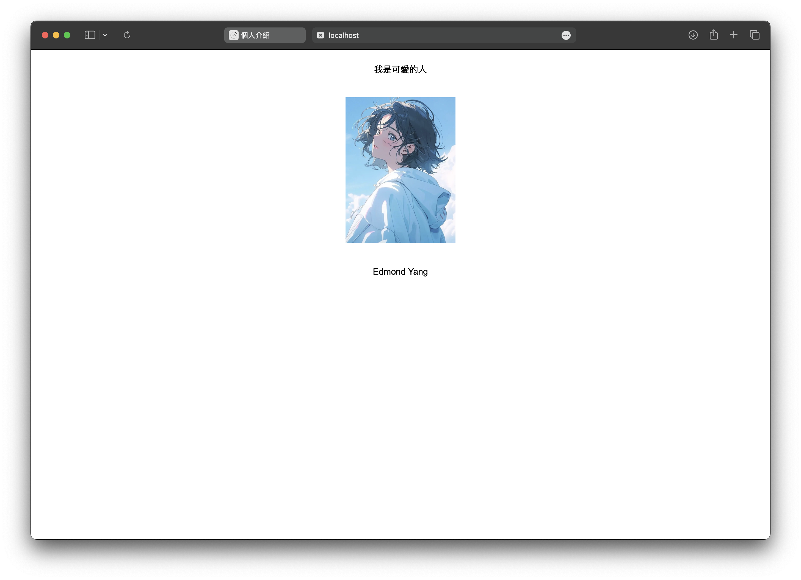

### 回首頁

點選 LOGO 即可回首頁觀看所有專案

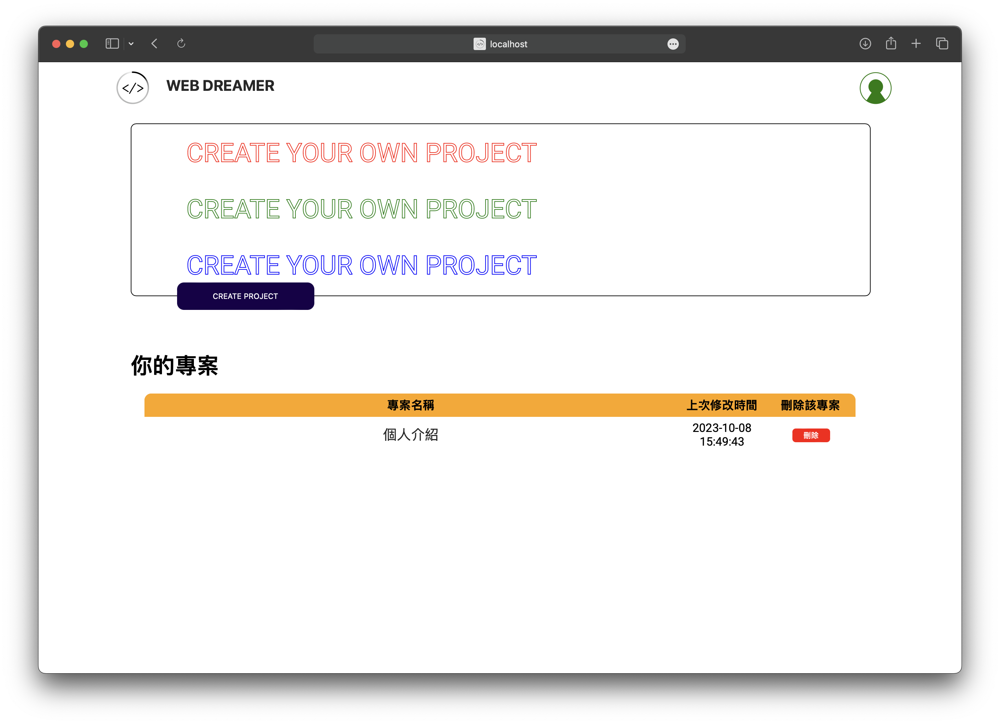

## 登出

1. 點選人像
2. 點擊 LOG OUT 即可登出

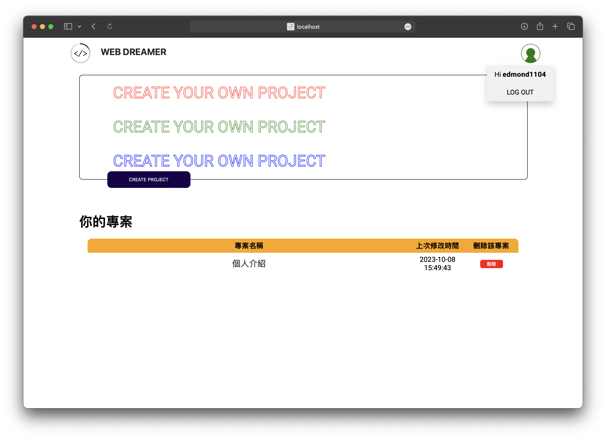

## 技術

### 前端

HTML、CSS、JavaScript、JQuery

### 後端

PHP

### 資料庫

MySQL

## 作者

[Edmond Yang](https://github.com/Edmond-Yang)、[David Yang](https://github.com/daaaaaaavid)